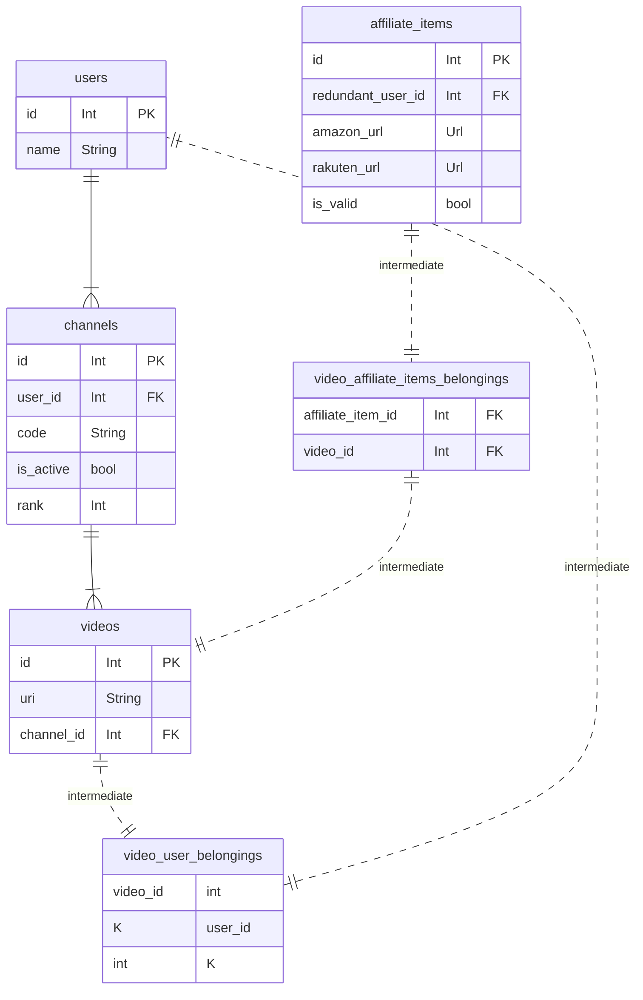

```mermaid
erDiagram
    users {
        id Int PK
        name String
    }
    channels {
        id Int PK
        user_id Int FK
        code String
        is_active bool
        rank Int
    }
    videos {
        id Int PK
        uri String
        channel_id Int FK
    }

    users ||--|{ channels : ""
    channels ||--|{ videos : ""

    affiliate_items {
        id Int PK
        redundant_user_id Int FK
        amazon_url Url
        rakuten_url Url
        is_valid bool
    }

    video_user_belongings {
        video_id int K
        user_id int K
    }

    video_affiliate_items_belongings {
        affiliate_item_id Int FK
        video_id Int FK
    }
    affiliate_items ||..||  video_affiliate_items_belongings : "intermediate"
    video_affiliate_items_belongings ||..||  videos : "intermediate"

    videos ||..||  video_user_belongings : "intermediate"
    video_user_belongings ||..||  users : "intermediate"
```
